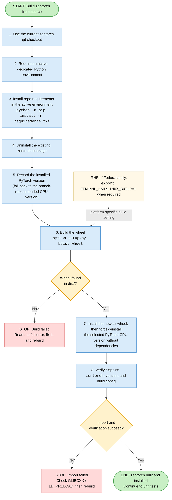

# zentorch build-from-source flow

This flow mirrors
[`scripts/build.sh`](scripts/build.sh) and the source-build procedure in
[README.md section 2.2](../../../README.md).

```mermaid
flowchart TD
    start([START: Build zentorch from source])
    checkout["1. Use the current zentorch git checkout"]
    env["2. Require an active, dedicated Python environment"]
    requirements["3. Install repo requirements in the active environment<br/><code>python -m pip install -r requirements.txt</code>"]
    uninstall["4. Uninstall the existing zentorch package"]
    torch["5. Record the installed PyTorch version<br/>(fall back to the branch-recommended CPU version)"]
    build["6. Build the wheel<br/><code>python setup.py bdist_wheel</code>"]
    rhel["RHEL / Fedora family:<br/><code>export ZENDNNL_MANYLINUX_BUILD=1</code> when required"]
    wheel{"Wheel found<br/>in dist/?"}
    buildFail["STOP: Build failed<br/>Read the full error, fix it, and rebuild"]
    install["7. Install the newest wheel, then force-reinstall<br/>the selected PyTorch CPU version without dependencies"]
    verify["8. Verify <code>import zentorch</code>, version, and build config"]
    imports{"Import and<br/>verification succeed?"}
    importFail["STOP: Import failed<br/>Check GLIBCXX / LD_PRELOAD, then rebuild"]
    done([END: zentorch built and installed<br/>Continue to unit tests])

    start --> checkout --> env --> requirements --> uninstall --> torch --> build --> wheel
    rhel -. platform-specific build setting .-> build
    wheel -- No --> buildFail
    wheel -- Yes --> install --> verify --> imports
    imports -- No --> importFail
    imports -- Yes --> done

    classDef terminal fill:#c9efc5,stroke:#55a75a,stroke-width:2px,color:#111;
    classDef action fill:#d9ebfa,stroke:#5b9bd5,stroke-width:1.5px,color:#111;
    classDef decision fill:#fff2cc,stroke:#e5a100,stroke-width:1.5px,color:#111;
    classDef stop fill:#ffd9d9,stroke:#e58c8c,stroke-width:1.5px,color:#111;
    classDef note fill:#fff8e7,stroke:#d6b656,stroke-width:1.25px,color:#111;

    class start,done terminal;
    class checkout,env,requirements,uninstall,torch,build,install,verify action;
    class wheel,imports decision;
    class buildFail,importFail stop;
    class rhel note;
```
