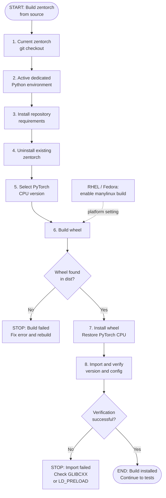

# zentorch build-from-source flow

This flow mirrors
[`scripts/build.sh`](scripts/build.sh) and the source-build procedure in
[README.md section 2.2](../../../README.md).

The build script installs the repository requirements before compiling so the
active environment supplies CMake and Ninja:

```bash
python -m pip install -r requirements.txt
python setup.py bdist_wheel
```

After building, it installs the newest wheel, restores the selected CPU-only
PyTorch version, and verifies the zentorch version and build configuration. On
RHEL/Fedora-family systems, set `ZENDNNL_MANYLINUX_BUILD=1` when required.


