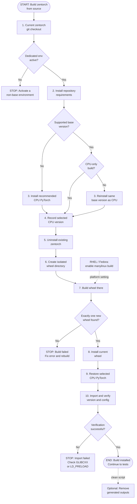

# zentorch build-from-source flow

This flow mirrors
[`scripts/build.sh`](scripts/build.sh) and the source-build procedure in
[README.md section 2.2](../../../README.md).

The build script installs repository requirements, validates a supported
CPU-only PyTorch build, and compiles into an isolated wheel directory:

```bash
python -m pip install -r requirements.txt
.claude/skills/setup-env/scripts/install_pytorch.sh
python setup.py bdist_wheel
```

Supported alternate CPU versions are preserved. A supported CUDA or ROCm build
is reinstalled as CPU at the same base version. Missing and unsupported
versions use the branch-recommended CPU version. Only the single wheel in the
isolated directory can be installed. Older wheels in `dist/` cannot be selected
or overwritten.

After installation, the script restores the selected CPU PyTorch version and
verifies the zentorch version and build configuration. On
RHEL/Fedora-family systems, set `ZENDNNL_MANYLINUX_BUILD=1` when required.
Generated outputs can be removed independently of Python packaging internals:

```bash
.claude/skills/build-zentorch-from-source/scripts/clean.sh
```


