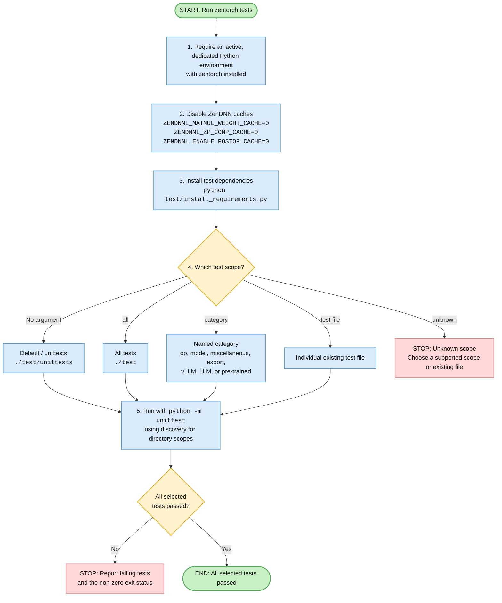

# zentorch unit-test flow

This flow mirrors
[`scripts/test.sh`](scripts/test.sh) and the unit-test procedure in
[README.md section 3](../../../README.md).

```mermaid
flowchart TD
    start([START: Run zentorch tests])
    env["1. Require an active, dedicated Python environment<br/>with zentorch installed"]
    cache["2. Disable ZenDNN caches<br/><code>ZENDNNL_MATMUL_WEIGHT_CACHE=0</code><br/><code>ZENDNNL_ZP_COMP_CACHE=0</code><br/><code>ZENDNNL_ENABLE_POSTOP_CACHE=0</code>"]
    deps["3. Install test dependencies<br/><code>python test/install_requirements.py</code>"]
    scope{"4. Which test scope?"}
    default["Default / unittests<br/><code>./test/unittests</code>"]
    all["All tests<br/><code>./test</code>"]
    category["Named category<br/>op, model, miscellaneous, export,<br/>vLLM, LLM, or pre-trained"]
    file["Individual existing test file"]
    invalid["STOP: Unknown scope<br/>Choose a supported scope or existing file"]
    run["5. Run with <code>python -m unittest</code><br/>using discovery for directory scopes"]
    passed{"All selected<br/>tests passed?"}
    failed["STOP: Report failing tests<br/>and the non-zero exit status"]
    done([END: All selected tests passed])

    start --> env --> cache --> deps --> scope
    scope -- No argument --> default --> run
    scope -- all --> all --> run
    scope -- category --> category --> run
    scope -- test file --> file --> run
    scope -- unknown --> invalid
    run --> passed
    passed -- No --> failed
    passed -- Yes --> done

    classDef terminal fill:#c9efc5,stroke:#55a75a,stroke-width:2px,color:#111;
    classDef action fill:#d9ebfa,stroke:#5b9bd5,stroke-width:1.5px,color:#111;
    classDef decision fill:#fff2cc,stroke:#e5a100,stroke-width:1.5px,color:#111;
    classDef stop fill:#ffd9d9,stroke:#e58c8c,stroke-width:1.5px,color:#111;

    class start,done terminal;
    class env,cache,deps,default,all,category,file,run action;
    class scope,passed decision;
    class invalid,failed stop;
```
