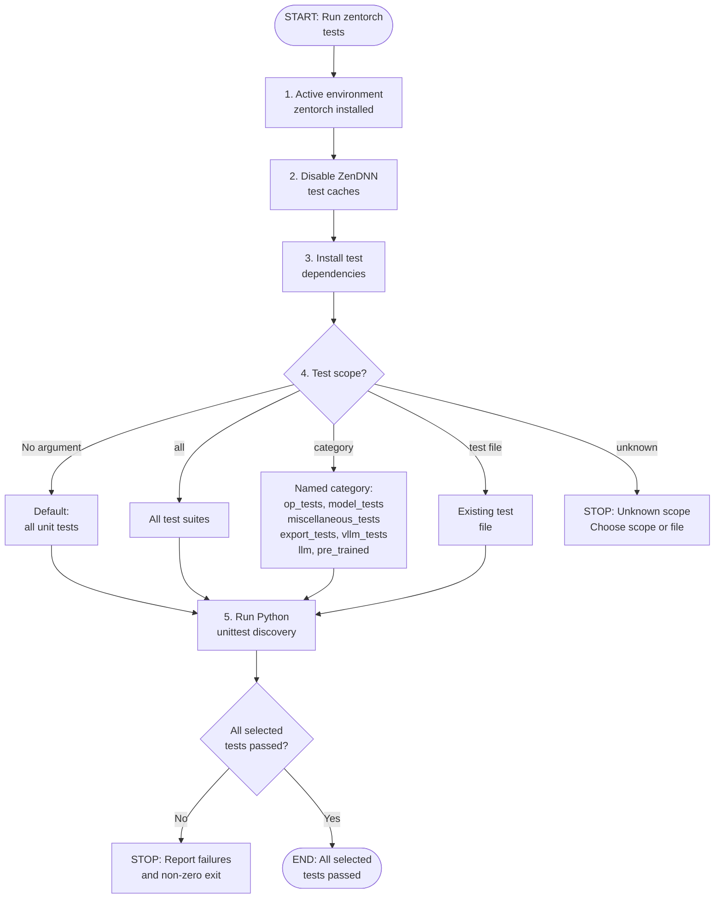

# zentorch unit-test flow

This flow mirrors
[`scripts/test.sh`](scripts/test.sh) and the unit-test procedure in
[README.md section 3](../../../README.md).

Before running tests, the script disables all required ZenDNN caches and
installs the matching test dependencies:

```bash
export ZENDNNL_MATMUL_WEIGHT_CACHE=0
export ZENDNNL_ZP_COMP_CACHE=0
export ZENDNNL_ENABLE_POSTOP_CACHE=0
python test/install_requirements.py
```

With no argument, the script runs all unit tests under `./test/unittests`.
Other supported scopes map to `./test`, a named test category, or one existing
test file.


