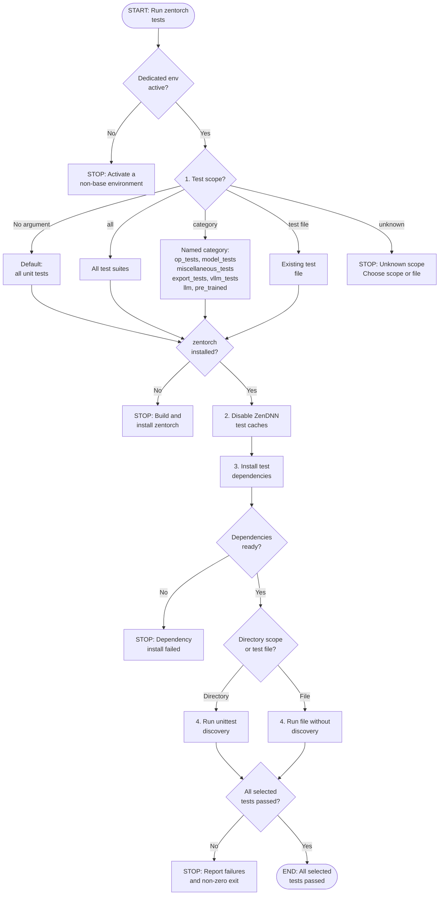

Copyright &copy; 2026 Advanced Micro Devices, Inc. All rights reserved.

# zentorch unit-test flow

This flow mirrors
[`scripts/test.sh`](scripts/test.sh) and the unit-test procedure in
[README.md section 3](../../../README.md).

The script first rejects a missing or `base` environment, then maps the
requested scope. Unknown scopes and nonexistent files stop before zentorch or
package checks, so they cannot mutate the environment. A direct file uses
`python -m unittest <file>`; directory scopes use discovery.

After scope validation, the script checks that zentorch is installed, disables
all required ZenDNN caches, and installs the matching test dependencies:

```bash
python -c "import zentorch"
export ZENDNNL_MATMUL_WEIGHT_CACHE=0
export ZENDNNL_ZP_COMP_CACHE=0
export ZENDNNL_ENABLE_POSTOP_CACHE=0
python test/install_requirements.py
```

The dependency installer covers `transformers`, `expecttest`, `parameterized`,
`hypothesis`, `deprecated`, and PyTorch-matched `torchvision` and `torchao`.
With no argument, the script runs all unit tests under `./test/unittests`.
Other supported scopes map to `./test`, a named test category, or one existing
test file. Export tests may write `model.pt2` and `model_z.pt2` in the checkout;
the script does not delete files by name because their ownership is unknown.


