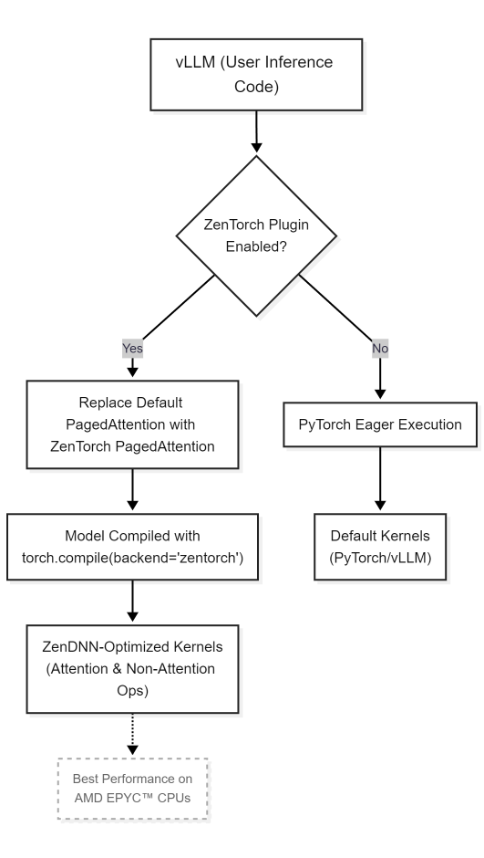

# vLLM-zentorch Plugin

> **Seamless, high-performance LLM inference on CPUs with zentorch and vLLM**
> *Accelerate your large language models on modern x86 CPUs—no code changes required.*

---

## Overview

The **vLLM-zentorch plugin** brings together [zentorch](https://github.com/amd/ZenDNN-pytorch-plugin) and [vLLM](https://blog.vllm.ai/2023/06/20/vllm.html) to deliver efficient, plug-and-play large language model (LLM) inference on modern x86 CPUs. By leveraging ZenDNN's highly optimized kernels, this plugin accelerates both attention and non-attention operations in vLLM, providing significant throughput improvements for popular LLMs.

zentorch is designed for acceleration of PyTorch workloads on CPUs, offering drop-in, high-performance implementations of key deep learning operations. When used with vLLM, zentorch automatically replaces default attention mechanisms and other compute-intensive kernels with ZenDNN-optimized versions—no code changes required. While optimized for AMD EPYC™ CPUs, the plugin supports any x86 CPU with the required ISA features.

---

## Key Features

- **Plug-and-Play Acceleration:** No code modifications required—just install zentorch alongside vLLM for automatic acceleration.
- **Seamless vLLM Integration:** vLLM detects zentorch and transparently uses ZenDNN-optimized attention and non-attention kernels for supported CPUs.
- **Optimized for Modern x86 CPUs:** Delivers best-in-class performance on AMD EPYC™ processors, while supporting a broad range of x86 CPUs with the necessary instruction set.
- **Powered by ZenDNN:** Leverages AMD's ZenDNN library for state-of-the-art, CPU-optimized neural network operations.

---

## Compatibility

- **vLLM:** v0.9.0 or later (explicitly tested; earlier versions may not be supported)

---

## Architecture

When both vLLM and the `zentorch` package are installed, vLLM automatically detects the zentorch platform and replaces its default attention mechanism with the highly optimized zentorch PagedAttention kernel.

This kernel leverages AMD EPYC specific intrinsics and optimizations to accelerate computations on AMD EPYC CPUs. However, the plugin may also function on other x86 CPUs that meet the required ISA. Further, we use zentorch to compile the LLM with `torch.compile`, replacing the native ops with zentorch's optimized ops.



---

## Installation

1. **Create a new Python environment:**

   > Note: To get started with conda, refer to [Miniforge Installation Guide](https://github.com/conda-forge/miniforge?tab=readme-ov-file#unix-like-platforms-macos-linux--wsl)

   **Using conda:**
   ```bash
   conda create -n vllm-env python=3.10
   conda activate vllm-env
   ```

2. **Build vLLM from Source**
   - Follow the official [vLLM Installation Guide](https://docs.vllm.ai/en/v0.9.0/getting_started/installation/cpu.html) for detailed, step-by-step instructions.
   - **Important:** Pre-built vLLM CPU binaries are not available. You must build vLLM from source to enable CPU support.
   - Ensure you check out the `v0.9.0` release tag or a later version before building.

3. **Install zentorch:**
   Refer to the [zentorch Installation Guide](https://github.com/amd/ZenDNN-pytorch-plugin?tab=readme-ov-file#2-installation) for detailed instructions.

---

## Usage

No code changes are required. Once installed, simply run your vLLM inference workload as usual. The plugin will be automatically detected and used for inference on supported x86 CPUs that meet the required ISA features. While optimized for AMD EPYC™ CPUs, it may also function on other compatible x86 processors.

> **Note:**
>
> - Upon importing vLLM, you should see the following message in the logs:
>   ```
>   INFO [__init__.py] Platform plugin zentorch is activated
>   ```

### Environment Configuration

To maximize efficiency, configure the following environment variables:

```bash
export ZENDNN_TENSOR_POOL_LIMIT=1024
export ZENDNN_MATMUL_ALGO=FP32:4,BF16:0
export ZENDNN_PRIMITIVE_CACHE_CAPACITY=1024
export ZENDNN_WEIGHT_CACHING=1

export VLLM_CPU_KVCACHE_SPACE=<kvcache_space_in_GB>
export VLLM_CPU_OMP_THREADS_BIND=<num_threads_to_bind>

# Install libtcmalloc-minimal4
sudo apt-get install libtcmalloc-minimal4
export LD_PRELOAD=/usr/lib/x86_64-linux-gnu/libtcmalloc_minimal.so.4:$LD_PRELOAD
# Install llvm-openmp
conda install -c conda-forge llvm-openmp=18.1.8=hf5423f3_1 -y
export LD_PRELOAD="<install_path>/miniconda3/pkgs/llvm-openmp-18.1.8-hf5423f3_1/lib/libiomp5.so:$LD_PRELOAD"
```

### Example: Standard vLLM inference code

```python
from vllm import LLM, SamplingParams

llm = LLM(model="microsoft/phi-2", dtype="bfloat16")
params = SamplingParams(temperature=0.0, top_p=0.95)
output = llm.generate(["Hello, world!"], sampling_params=params)
print(output)

# zentorch plugin will accelerate attention if installed and running on supported x86 CPUs (best performance on AMD EPYC™ CPUs)
```

### Performance Recommendations

For optimal performance with vLLM CPU inference:
- Set the temperature parameter to 0.0 
- Use supported x86 CPUs (with best results on the latest AMD EPYC™ CPUs)

> **Note:** These hardware recommendations are specific to vLLM CPU workloads. 

---

## Support & Feedback

For questions, feedback, or to contribute, please visit the [AMD ZenDNN PyTorch Plugin GitHub page](https://github.com/amd/ZenDNN-pytorch-plugin)
